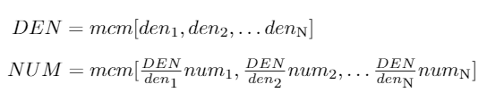
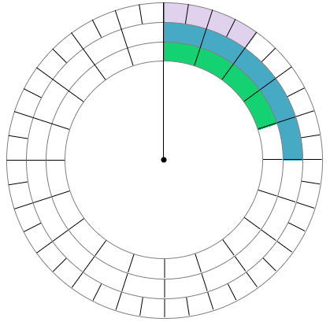
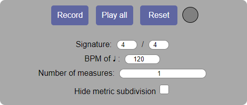
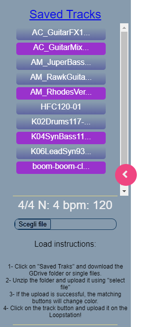
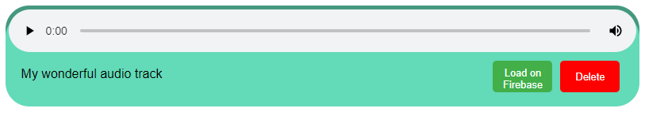
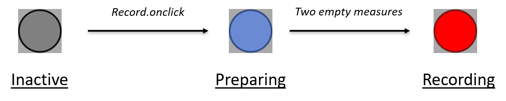
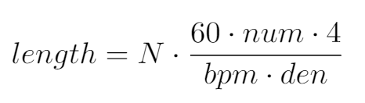

# 1. Introduction
CircularLoopstation is a web application developed for musician and composers that aims to assist them in the visualization of complex polyrhythmic structures through the design of an innovative loopstation. The application comes with various controls and graphic features that give to the user a large number of possibilities in the construction of his own loop.

The application is developed by Gioele Greco and Luca Torelli, as part of the Advanced Coding Tools & Methodologies course at Politecnico di Milano, Italy.

- CircularLoopstation is available at: https://circloopstation.surge.sh/
- Link to CodePen: https://codepen.io/Torelli/pen/VwexxWZ

In the following video is provided a simple demonstration of the use of CircularLoopstation:

# 2. Behind the concept: polyrhytm and polymeter
Everyone says "music is made of rhythmic sound", so what is rhythm?

Rhythm in music is characterized by a repeating sequence of stressed (strong) and unstressed (weak) beats, and it's divided into bars organized by time signature and tempo indications.

Time signature is a notational convention used to specify how many beats are contained in each measure, and which note value is equivalent to a beat.
Tempo indication denotes how long is the beat distance. It's defined in beat per minutes and tipically it is associated to the ♩ (1/4). *(For example ♩=60bpm means that there is one ♩ every one second)*

Time signature, normally, is based on fraction of 2 or 3. It's common to read on partitures quavers, triplets (3 notes played in the time of 2 equivalent notes), or multiple and submultiples of 2 and 3.

Since XX century, expecially in contempourary music with ethnic influences, and following in jazz and other genres, the composers decides to use more complex rhythms played simultaneously. This to create an extraordinary exotic effect of cycles in cycles that can create changing harmonies with the same material. Today techniques as polyrhythm and polymeter are well known to mathphilus composers, who write their music without being anchored to the same metric subdivision.

We call ***polyrhythm*** the simultaneous use of two or more conflicting rhythms, that generate a particualr rhythmic pattern.

We call ***polymeter*** the suerposition of different meters (different time signatures) that desynchronize themselves over time.

# 3. The loopstation
CircularLoopstation allows the visualization of the rythmic structure thanks to a clock-like graphic component that follows the progression of the loop and shows the alternation of all the audio tracks that have been uploaded into the loop. The loopstation is designed to be able to manage and visualize different signatures and durations at the same time, ensuring a simple but powerful understanding of the underlying structure of the cycle. The application provides two ways of importing audio tracks into the loopstation, allowing the user to easily create its own customizable musical loop. 

## 3.1. Graphic components
Circular Loopstation comes with a simple and colored graphic interface that allows the user to build and interact with the loop in an intuitive and creative manner. Let's see what this graphic interface is composed of.

### 3.1.1. The Circle
The Circle is the main component of the application, from wich the name "CircularLoopstation" itself derives. It looks like an animated clock-like graphic component in which is shown the superposition and the real time progression of all the tracks that are present in the loop, represented as colored circular crown sectors.

The lengths of the colored sectors are calculated in such a way that each track represents an integer divisor of the length of the whole loop, in constant relation with the length of the other tracks. This way, the duration of the whole loop is ideally represented by a circular crown sector of 360°, that is the entire circumference of The Circle (please note that with "whole length of the loop" here is intended the time after wich all the tracks of the loop restart from the beginning at the same time). The size of each circular crown sector is computed each time a new track is imported into the loop (or deleted), on the basis of the rythm parameters of the newest track and the previous imported ones.

Attached to this component the user can find colored fractions that keep time of the playing tracks in real time, according with their time signature. The black fraction, located at the top right of the page, indicates the equivalent in time signature of the length of the whole loop, and it also keep time of the whole loop in real time while playing.

How is that fraction computed?

Considering the fraction as NUM/DEN, and N as the number of tracks in the loop:

*With the leatest version of CircularLoopstation is also possible to visualize the metric subdivision of the looping structure thanks to radial segments that show the partition of each track in beats:*

### 3.1.2. Control box
The control box is the component with which the user can control the loopstation and set recording parameters. It has two main configurations: a simpler one and an advanced (or complete) one.
At the bottom of the control box appear warning messages and is visualized the metronome while recording.

The simpler configuration contains three buttons, four numeric inputs and one checkbox.

Buttons:
- Record: allows to start recording,
- Play All: allows to play the whole loop,
- Reset: stops every track and the circles animations.

On the right of these buttons there is a light indicator that turns blue during record preparing and turns red during the recording session.

Numeric inputs:
- Numerator and denominator of time signature,
- BPM, beats per minute (or rather tempo velocity),
- Number of measures.

The checkbox allows the user to hide the graphical metric subdivision.

The advanced (or complete) configuration, in addition, contains more controls that become visible by clicking on the white circle. These controls are:
- Sliders for controlling the dimensions of the graphic components;
- Manual Synch Value (100 ms by default): while recording, allows the user to set the gap between the played tracks and the recording;
- Recording latency: (50 ms by default): it adjusts the gap between the ideal recording start time and the effective recording start time.

These parameters are necessary to work well on every device, because their value depend on device hardware or settings.

### 3.1.3. Lateral panel
The lateral panel is the interface part dedicated to the management of the tracks inside the database. It is composed by different sections with different funcitonalities. Specifically, from the top to the bottom, we can find: 

- Title ("<ins>Saved Tracks</ins>"): link to the GDrive folder that contains all the stored tracks,
 
- Tracks container: in this section there are all the tracks stored in the database. Positioning the mouse pointer over one of the tracks, all the rhythm information about the selected item will be displayed. Whenever the user uploads here any tracks using the "Select file" input, the corrisponding button will change color, and by clicking on it the application will import the track into the loop.
 
- Info section: displays the rhytm parameters of the selected track,
 
- "Select file": input that allows the user to upload external files into the database,
 
- Instruction section: displays istructions about loading and advanced settings.

    

### 3.1.4. Audio banners
Every time an audio track is imported into the loopstation, a colored banner is created beneath the control box.

Inside the banner the user can find the audio clip (with play/pause button and volume slider), the name of the track and two buttons:

- Load on Firebase: load the selected track into the database (as described in the section 3.2.2). Of course this button is not present when an audio track is imported into the loop from the database itself.

- Delete: delete the selected track and the corresponding circle.

## 3.2. Tracks management
The application provides two ways for importing an audio track into the loop:

### 3.2.1. Audio recording
The first tool that have been developed for the creation of an audio track is a simple audio recorder. The user can choose all the parameters that are necessary to compute the length of the recording (time signature, bpm, number of measures) by setting their values into the control box. Then, when the button "Record" is clicked, a metronome will start beating inside the control box according with the time settings chosen by the user. A colored circular crown sector will also appear around The Circle, indicating the contribution of the recorded track to the whole loop.

After two beating measures, the recording session will start, announced by the indicator light that will turn red.

The recording session will end by itself once reached the computed recording length (in seconds), previously calculated on the basis of the user input parameters as follow:

The user can stop the recording at any moment by pressing the "esc" button.

As the registration is ended, the application asks to the user to set a name for the recorded sound clip. After that, the audio clip will be visible as a colored banner beneath the control box.

This system allows the user to record a lot of different tracks and to visualize their superposition by simply looking at the graphic clock-like component.

### 3.2.2. Uploading from database
CircularLoopstation can also import files into the loopstation from a database, that can be enlarged by every user by uploading tracks with the "Load on Firebase" button.

How can I import files in CircularLoopstation? *(Instructions are in the side panel)*

- Click on "Saved Tracks" and download the GDrive folder or single files.

- Unzip the folder and upload it using "select file".

- If the upload is successful, the matching buttons will change color.

- Click on the track button and upload it on the Loopstation!

How can I load files into the database? *(Instructions appear into the control box)*

By clicking on the "Load on Firebase" button, the user can download the selected track and upload it on the database through the GDrive window that will appear. This way, he can both share its recordings with other users and store the files locally on his computer.

The files stored in the database are managed by the administrator, and can be deleted after some days if they are no more used.

However, it's not possible to import every kind of file into the loop, because the application, to work well, needs some parameters like duration, time signature and bpm. To do so, the trick is to record a track with the same file name and the correct parameters, click on "Load on Firebase", and upload the desired file instead of the recording. 

# 4. Notes
The developement of CircularLoopstation has been a really challenging and exciting task. Along with the complexity in managing the  polyrythmic problem, lots of ideas and solutions came out. We hope that this application will suggest the developement of more sophisticated tools that could exploit this circular visualization of polyrhytmic structures as part of a new, creative and innovtive support for musicians and composers.

## 4.1. Contacts
Send us a feeedback at: actamproject@gmail.com

Or contact us personally:

- Gioele Greco: gioele.greco@mail.polimi.it
- Luca Torelli: luca1.torelli@mail.polimi.it

Music and Acoustic Engineering - Politecnico di Milano, Italy.

